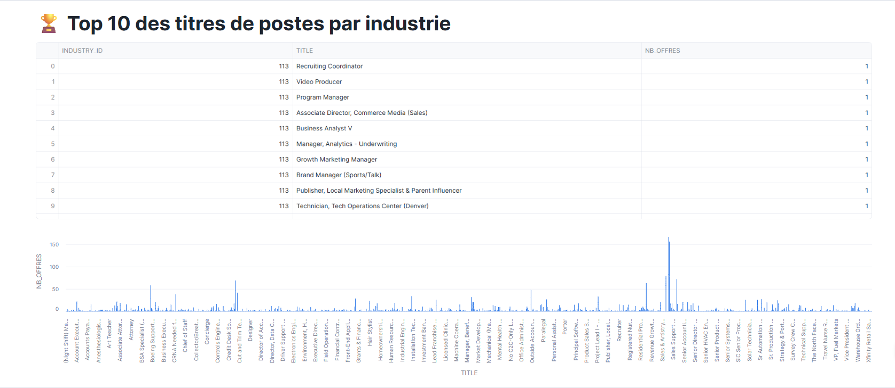
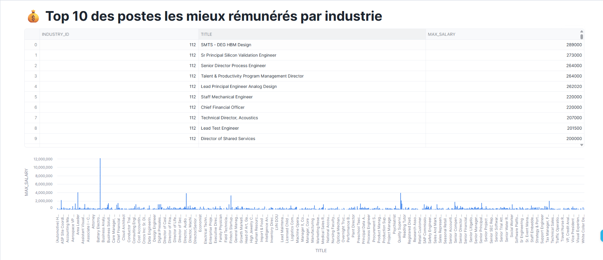
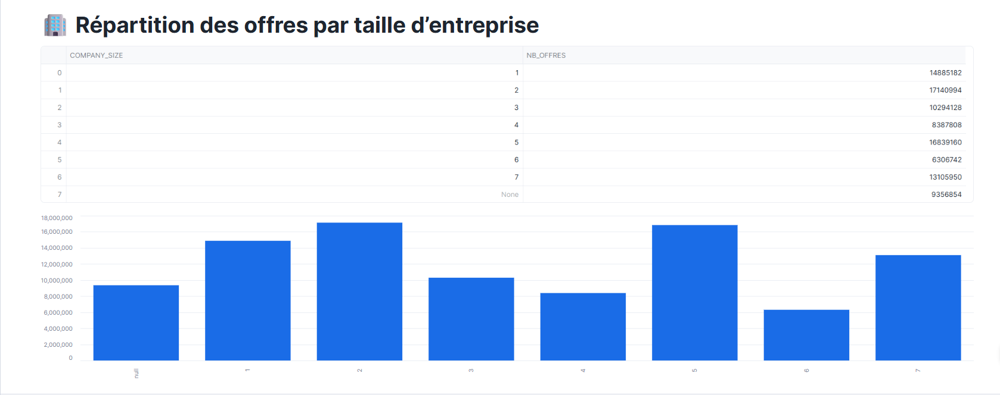
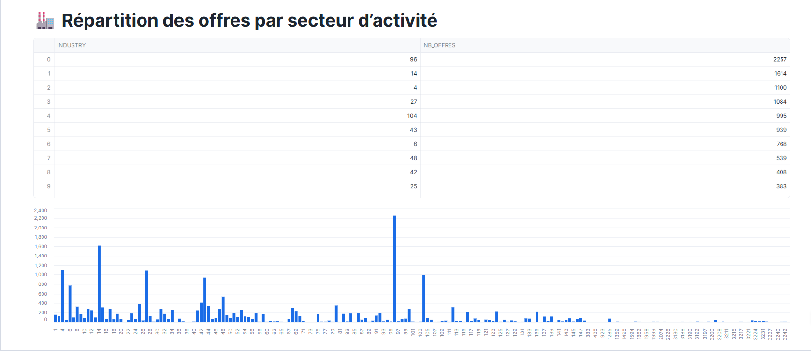
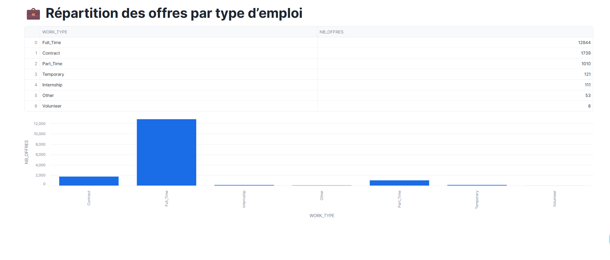

# Nom des participants au projet: Heriol ZEUFACK // Frédo AGBEKODO

# 🧊 Analyse des Offres d'Emploi LinkedIn avec Snowflake

> **Projet MBAESG — Architecture Big Data**  
> Analyse d'un dataset LinkedIn via Snowflake et visualisation avec Streamlit

---

##  Table des matières

1. [Présentation du projet](#1-présentation-du-projet)
2. [Jeu de données](#2-jeu-de-données)
3. [Étape 1 — Initialisation de la base de données](#4-étape-1--initialisation-de-la-base-de-données)
4. [Étape 2 — Création du stage externe S3](#5-étape-2--création-du-stage-externe-s3)
5. [Étape 3 — Définition des formats de fichiers](#6-étape-3--définition-des-formats-de-fichiers)
6. [Étape 4 — Création des tables cibles](#7-étape-4--création-des-tables-cibles)
7. [Étape 5 — Création des vues de staging](#8-étape-5--création-des-vues-de-staging)
8. [Étape 6 — Chargement des données](#9-étape-6--chargement-des-données)
9. [Étape 7 — Analyses et visualisations Streamlit](#10-étape-7--analyses-et-visualisations-streamlit)
10. [Problèmes rencontrés et solutions](#11-problèmes-rencontrés-et-solutions)
11. [Structure du dépôt](#12-structure-du-dépôt)

---

## 1. Présentation du projet

Ce projet explore un large dataset d'offres d'emploi LinkedIn pour effectuer des analyses sur le marché du travail.  
L'ensemble du pipeline — ingestion, transformation, stockage et visualisation — est réalisé exclusivement via des scripts (SQL + Python), sans utilisation de l'interface graphique Snowflake.

**Technologies utilisées :**
- **Snowflake** — entrepôt de données cloud (base, stage, tables, vues)
- **AWS S3** — stockage source des fichiers bruts (bucket public fourni)
- **Streamlit** — visualisation des analyses directement dans Snowflake

---

## 2. Jeu de données

Les fichiers sont hébergés dans le bucket S3 public : `s3://snowflake-lab-bucket/`

| Fichier | Format | Description |
|---|---|---|
| `job_postings.csv` | CSV | Détails des offres d'emploi (titre, salaire, localisation, type de contrat…) |
| `benefits.csv` | CSV | Avantages associés à chaque offre (mutuelle, 401K…) |
| `employee_counts.csv` | CSV | Nombre d'employés et de followers par entreprise |
| `job_skills.csv` | CSV | Compétences requises par offre |
| `companies.json` | JSON | Informations détaillées sur chaque entreprise |
| `company_industries.json` | JSON | Secteurs d'activité des entreprises |
| `company_specialities.json` | JSON | Spécialités des entreprises |
| `job_industries.json` | JSON | Secteurs d'activité associés à chaque offre |

---

## 3. Étape 1 — Initialisation de la base de données

```sql
-- Création de la base de données nommée "linkedin"
CREATE DATABASE IF NOT EXISTS linkedin;

-- Sélection de la base et du schéma par défaut
USE DATABASE linkedin;
USE SCHEMA PUBLIC;
```

> On crée une base dédiée `linkedin` pour isoler toutes les tables, vues et stages du projet.  
> Le schéma `PUBLIC` est le schéma par défaut dans Snowflake.

---

## 4. Étape 2 — Création du stage externe S3

```sql
-- Création d'un stage externe pointant vers le bucket S3 public
CREATE OR REPLACE STAGE linkedin_stage
  URL = 's3://snowflake-lab-bucket/';

-- Vérification du contenu du stage (liste les fichiers disponibles)
LIST @linkedin_stage;
```

> Un **stage externe** est un pointeur vers un emplacement de stockage cloud (ici AWS S3).  
> Il permet à Snowflake d'accéder aux fichiers distants sans les copier localement.  
> Le bucket étant public, aucune configuration de credentials n'est nécessaire.

---

## 5. Étape 3 — Définition des formats de fichiers

### 5.1 Format CSV

```sql
CREATE OR REPLACE FILE FORMAT csv
  TYPE              = 'CSV'
  FIELD_DELIMITER   = ','           -- séparateur de colonnes
  RECORD_DELIMITER  = '\n'          -- séparateur de lignes
  SKIP_HEADER       = 1             -- ignore la première ligne (en-têtes)
  FIELD_OPTIONALLY_ENCLOSED_BY = '\042'  -- gère les champs entre guillemets (")
  NULL_IF           = ('');         -- traite les chaînes vides comme NULL
```

> Ce format gère les cas courants des CSV : guillemets autour des champs, ligne d'en-tête à ignorer, valeurs vides converties en `NULL`.

### 5.2 Format JSON

```sql
CREATE OR REPLACE FILE FORMAT json
  TYPE                = 'JSON'
  STRIP_OUTER_ARRAY   = TRUE    -- supprime le tableau racine [...] pour lire objet par objet
  STRIP_NULL_VALUES   = FALSE   -- conserve les champs à valeur null
  IGNORE_UTF8_ERRORS  = FALSE   -- lève une erreur si l'encodage UTF-8 est invalide
  SKIP_BYTE_ORDER_MARK = TRUE   -- ignore le BOM éventuel en début de fichier
  ALLOW_DUPLICATE     = FALSE   -- rejette les clés JSON dupliquées
  DATE_FORMAT         = 'AUTO'  -- détection automatique du format de date
  TIMESTAMP_FORMAT    = 'AUTO'  -- détection automatique du format d'horodatage
  TRIM_SPACE          = FALSE   -- conserve les espaces
  NULL_IF             = ('');   -- chaînes vides converties en NULL
```

> `STRIP_OUTER_ARRAY = TRUE` est essentiel ici car les fichiers JSON sont des tableaux d'objets `[{...}, {...}]`.  
> Cette option découpe le tableau pour traiter chaque objet comme une ligne distincte.

```sql
-- Vérification des formats créés
SHOW FILE FORMATS IN DATABASE linkedin;
```

---

## 6. Étape 4 — Création des tables cibles

### 6.1 Table `job_postings`

```sql
CREATE OR REPLACE TABLE job_postings (
    job_id                     NUMBER           NOT NULL PRIMARY KEY,
    company_name               VARCHAR(255),
    title                      VARCHAR(255),
    description                TEXT,
    max_salary                 FLOAT,
    med_salary                 FLOAT,
    min_salary                 FLOAT,
    pay_period                 VARCHAR(50),      -- Hourly, Monthly, Yearly
    formatted_work_type        VARCHAR(50),      -- Fulltime, Parttime, Contract
    location                   VARCHAR(255),
    applies                    NUMBER,           -- nombre de candidatures reçues
    original_listed_time       TIMESTAMP_NTZ,
    remote_allowed             BOOLEAN,
    views                      NUMBER,
    job_posting_url            VARCHAR(1000),
    application_url            VARCHAR(1000),
    application_type           VARCHAR(100),     -- offsite, complex/simple onsite
    expiry                     TIMESTAMP_NTZ,
    closed_time                TIMESTAMP_NTZ,
    formatted_experience_level VARCHAR(100),     -- entry, associate, executive…
    skills_desc                TEXT,
    listed_time                TIMESTAMP_NTZ,
    posting_domain             VARCHAR(255),
    sponsored                  BOOLEAN,
    work_type                  VARCHAR(100),
    currency                   VARCHAR(10),
    compensation_type          VARCHAR(100)
);
```

> Table centrale du projet — elle contient toutes les offres d'emploi LinkedIn.  
> `job_id` est la clé primaire et sert de clé de jointure pour `benefits`, `job_skills` et `job_industries`.  
> Les timestamps sont stockés en `TIMESTAMP_NTZ` (sans timezone) car les sources sont des Unix timestamps.

---

### 6.2 Table `benefits`

```sql
CREATE OR REPLACE TABLE benefits (
    job_id   NUMBER        NOT NULL,
    inferred BOOLEAN,                -- TRUE si l'avantage est inféré par LinkedIn (non explicite)
    type     VARCHAR(100),           -- ex : 401K, Medical Insurance, Dental…
    CONSTRAINT fk_benefits_job FOREIGN KEY (job_id) REFERENCES job_postings(job_id)
);
```

> La contrainte de clé étrangère (`FOREIGN KEY`) garantit qu'un avantage ne peut être associé qu'à une offre existante.

---

### 6.3 Table `companies`

```sql
CREATE OR REPLACE TABLE companies (
    company_id   NUMBER        NOT NULL PRIMARY KEY,
    name         VARCHAR(255),
    description  TEXT,
    company_size NUMBER,       -- groupe de 0 (très petite) à 7 (très grande)
    state        VARCHAR(100),
    country      VARCHAR(100),
    city         VARCHAR(100),
    zip_code     VARCHAR(20),
    address      VARCHAR(500),
    url          VARCHAR(1000) -- lien vers la page LinkedIn de l'entreprise
);
```

---

### 6.4 Table `employee_counts`

```sql
CREATE OR REPLACE TABLE employee_counts (
    company_id     NUMBER   NOT NULL,
    employee_count NUMBER,
    follower_count NUMBER,
    time_recorded  NUMBER,   -- timestamp Unix de la collecte de la donnée
    CONSTRAINT fk_emp_company FOREIGN KEY (company_id) REFERENCES companies(company_id)
);
```

---

### 6.5 Table `job_skills`

```sql
CREATE OR REPLACE TABLE job_skills (
    job_id    NUMBER       NOT NULL,
    skill_abr VARCHAR(100) NOT NULL,  -- abréviation de la compétence
    CONSTRAINT pk_job_skills     PRIMARY KEY (job_id, skill_abr),
    CONSTRAINT fk_skills_job     FOREIGN KEY (job_id) REFERENCES job_postings(job_id)
);
```

> La clé primaire est composite `(job_id, skill_abr)` car une offre peut requérir plusieurs compétences.

---

### 6.6 Table `job_industries`

```sql
CREATE OR REPLACE TABLE job_industries (
    job_id      NUMBER NOT NULL,
    industry_id NUMBER NOT NULL,
    CONSTRAINT pk_job_industries  PRIMARY KEY (job_id, industry_id),
    CONSTRAINT fk_industries_job  FOREIGN KEY (job_id) REFERENCES job_postings(job_id)
);
```

---

### 6.7 Table `company_specialities`

```sql
CREATE OR REPLACE TABLE company_specialities (
    company_id NUMBER       NOT NULL,
    speciality VARCHAR(255) NOT NULL,
    CONSTRAINT pk_company_specialities PRIMARY KEY (company_id, speciality),
    CONSTRAINT fk_spec_company         FOREIGN KEY (company_id) REFERENCES companies(company_id)
);
```

---

### 6.8 Table `company_industries`

```sql
CREATE OR REPLACE TABLE company_industries (
    company_id NUMBER       NOT NULL,
    industry   VARCHAR(255) NOT NULL,
    CONSTRAINT pk_company_industries PRIMARY KEY (company_id, industry),
    CONSTRAINT fk_ind_company        FOREIGN KEY (company_id) REFERENCES companies(company_id)
);
```

---

## 7. Étape 5 — Création des vues de staging

Avant d'insérer les données dans les tables cibles, on crée des **vues de staging** qui lisent directement les fichiers bruts depuis le stage S3.  
Cette approche permet de séparer la lecture (staging) de la transformation (insertion), facilitant le débogage.

### 7.1 Vues pour les fichiers JSON

```sql
-- Vue sur le fichier companies.json
-- $1::VARIANT lit chaque objet JSON comme un type semi-structuré Snowflake
CREATE OR REPLACE VIEW stg_companies AS
SELECT $1::VARIANT AS raw
FROM @linkedin_stage/companies.json
(FILE_FORMAT => json);

-- Vue sur company_industries.json
CREATE OR REPLACE VIEW stg_company_industries AS
SELECT $1::VARIANT AS raw
FROM @linkedin_stage/company_industries.json
(FILE_FORMAT => json);

-- Vue sur company_specialities.json
CREATE OR REPLACE VIEW stg_company_specialities AS
SELECT $1::VARIANT AS raw
FROM @linkedin_stage/company_specialities.json
(FILE_FORMAT => json);

-- Vue sur job_industries.json
CREATE OR REPLACE VIEW stg_job_industries AS
SELECT $1::VARIANT AS raw
FROM @linkedin_stage/job_industries.json
(FILE_FORMAT => json);
```

> `$1::VARIANT` : dans Snowflake, `$1` désigne la première (et unique) colonne d'un fichier JSON.  
> Le cast `::VARIANT` permet ensuite d'accéder aux champs via la notation `raw:champ`.

### 7.2 Vues pour les fichiers CSV

```sql
-- Vue sur job_postings.csv
-- Chaque colonne positionnelle ($1, $2…) est castée vers son type cible
CREATE OR REPLACE VIEW stg_job_postings AS
SELECT
    $1::NUMBER    AS job_id,
    $2::VARCHAR   AS company_name,
    $3::VARCHAR   AS title,
    $4::VARCHAR   AS description,
    $5::FLOAT     AS max_salary,
    $6::FLOAT     AS med_salary,
    $7::FLOAT     AS min_salary,
    $8::VARCHAR   AS pay_period,
    $9::VARCHAR   AS formatted_work_type,
    $10::VARCHAR  AS location,
    $11::NUMBER   AS applies,
    $12::NUMBER   AS original_listed_time,  -- Unix timestamp → converti plus tard
    $13::BOOLEAN  AS remote_allowed,
    $14::NUMBER   AS views,
    $15::VARCHAR  AS job_posting_url,
    $16::VARCHAR  AS application_url,
    $17::VARCHAR  AS application_type,
    $18::NUMBER   AS expiry,
    $19::NUMBER   AS closed_time,
    $20::VARCHAR  AS formatted_experience_level,
    $21::VARCHAR  AS skills_desc,
    $22::NUMBER   AS listed_time,
    $23::VARCHAR  AS posting_domain,
    $24::BOOLEAN  AS sponsored,
    $25::VARCHAR  AS work_type,
    $26::VARCHAR  AS currency,
    $27::VARCHAR  AS compensation_type
FROM @linkedin_stage/job_postings.csv
(FILE_FORMAT => csv);

-- Vue sur benefits.csv
CREATE OR REPLACE VIEW stg_benefits AS
SELECT
    $1::NUMBER  AS job_id,
    $2::BOOLEAN AS inferred,
    $3::VARCHAR AS type
FROM @linkedin_stage/benefits.csv
(FILE_FORMAT => csv);

-- Vue sur employee_counts.csv
CREATE OR REPLACE VIEW stg_employee_counts AS
SELECT
    $1::NUMBER AS company_id,
    $2::NUMBER AS employee_count,
    $3::NUMBER AS follower_count,
    $4::NUMBER AS time_recorded
FROM @linkedin_stage/employee_counts.csv
(FILE_FORMAT => csv);

-- Vue sur job_skills.csv
CREATE OR REPLACE VIEW stg_job_skills AS
SELECT
    $1::NUMBER  AS job_id,
    $2::VARCHAR AS skill_abr
FROM @linkedin_stage/job_skills.csv
(FILE_FORMAT => csv);
```

---

## 8. Étape 6 — Chargement des données

Les données sont insérées dans les tables cibles depuis les vues de staging, avec des transformations appliquées à la volée.

> **Ordre d'insertion important** : les tables avec clés étrangères doivent être alimentées après leurs tables parentes.  
> Ordre : `companies` → `job_postings` → `benefits`, `employee_counts`, `job_skills`, `job_industries`, `company_industries`, `company_specialities`

### 8.1 Chargement de `companies`

```sql
INSERT INTO companies (
    company_id, name, description, company_size,
    state, country, city, zip_code, address, url
)
SELECT
    raw:company_id::NUMBER        AS company_id,
    TRIM(raw:name::VARCHAR)       AS name,         -- suppression des espaces superflus
    TRIM(raw:description::VARCHAR) AS description,
    raw:company_size::NUMBER      AS company_size,
    TRIM(raw:state::VARCHAR)      AS state,
    TRIM(raw:country::VARCHAR)    AS country,
    TRIM(raw:city::VARCHAR)       AS city,
    -- Validation du code postal : format alphanumérique entre 3 et 10 caractères
    CASE
        WHEN REGEXP_LIKE(TRIM(raw:zip_code::VARCHAR), '^[0-9A-Za-z -]{3,10}$')
        THEN TRIM(raw:zip_code::VARCHAR)
        ELSE NULL
    END AS zip_code,
    TRIM(raw:address::VARCHAR)    AS address,
    TRIM(raw:url::VARCHAR)        AS url
FROM stg_companies
WHERE raw:company_id IS NOT NULL;  -- filtre les enregistrements sans identifiant
```

---

### 8.2 Chargement de `company_industries`

```sql
INSERT INTO company_industries (company_id, industry)
SELECT
    raw:company_id::NUMBER      AS company_id,
    TRIM(raw:industry::VARCHAR) AS industry
FROM stg_company_industries
WHERE raw:company_id IS NOT NULL
  AND raw:industry IS NOT NULL;
```

---

### 8.3 Chargement de `company_specialities`

```sql
-- Les spécialités sont stockées sous forme de chaîne séparée par des virgules dans le JSON
-- LATERAL FLATTEN + SPLIT permet d'éclater ces valeurs en lignes distinctes
INSERT INTO company_specialities (company_id, speciality)
SELECT
    raw:company_id::NUMBER       AS company_id,
    TRIM(value::VARCHAR)         AS speciality   -- "value" = chaque élément après le SPLIT
FROM stg_company_specialities,
LATERAL FLATTEN(input => SPLIT(raw:speciality::VARCHAR, ','))
WHERE raw:company_id IS NOT NULL
  AND raw:speciality IS NOT NULL
  AND LENGTH(TRIM(value::VARCHAR)) <= 100;  -- filtre les valeurs trop longues
```

> `LATERAL FLATTEN` est une fonction Snowflake qui "déplie" un tableau ou une liste en lignes.  
> Combiné à `SPLIT`, il permet de transformer `"Marketing, Sales, HR"` en 3 lignes distinctes.

---

### 8.4 Chargement de `job_industries`

```sql
INSERT INTO job_industries (job_id, industry_id)
SELECT
    raw:job_id::NUMBER             AS job_id,
    TRIM(raw:industry_id::VARCHAR) AS industry_id
FROM stg_job_industries
WHERE raw:job_id IS NOT NULL
  AND raw:industry_id IS NOT NULL;
```

---

### 8.5 Chargement de `job_postings`

```sql
INSERT INTO job_postings (
    job_id, company_name, title, description,
    max_salary, med_salary, min_salary, pay_period,
    formatted_work_type, location, applies,
    original_listed_time, views,
    job_posting_url, application_url, application_type,
    expiry, closed_time, formatted_experience_level,
    skills_desc, listed_time, posting_domain,
    work_type, currency, compensation_type
)
SELECT
    job_id,
    TRIM(company_name),
    TRIM(title),
    TRIM(description),
    max_salary,
    med_salary,
    min_salary,
    INITCAP(TRIM(pay_period)),            -- normalisation : "HOURLY" → "Hourly"
    INITCAP(TRIM(formatted_work_type)),   -- normalisation : "fulltime" → "Fulltime"
    TRIM(location),
    applies,
    TO_TIMESTAMP_NTZ(original_listed_time),  -- conversion Unix timestamp → TIMESTAMP
    views,
    -- Validation des URLs : conserve uniquement celles qui commencent par "http"
    CASE WHEN job_posting_url  ILIKE 'http%' THEN job_posting_url  ELSE NULL END,
    CASE WHEN application_url  ILIKE 'http%' THEN application_url  ELSE NULL END,
    LOWER(TRIM(application_type)),        -- normalisation en minuscules
    TO_TIMESTAMP_NTZ(expiry),
    TO_TIMESTAMP_NTZ(closed_time),
    INITCAP(TRIM(formatted_experience_level)),
    TRIM(skills_desc),
    TO_TIMESTAMP_NTZ(listed_time),
    TRIM(posting_domain),
    INITCAP(TRIM(work_type)),
    UPPER(TRIM(currency)),                -- normalisation en majuscules : "usd" → "USD"
    LOWER(TRIM(compensation_type))
FROM stg_job_postings
WHERE job_id IS NOT NULL;
```

> **Transformations appliquées :**
> - `INITCAP` : met en majuscule la première lettre de chaque mot (normalisation des catégories)
> - `TO_TIMESTAMP_NTZ` : convertit les timestamps Unix (nombre de secondes) en type `TIMESTAMP_NTZ`
> - Validation des URLs avec `ILIKE 'http%'` pour rejeter les valeurs malformées
> - `UPPER` / `LOWER` pour normaliser la casse des codes devise et types de compensation

---

### 8.6 Chargement de `benefits`

```sql
-- Seuls les job_id présents dans job_postings sont acceptés (intégrité référentielle)
INSERT INTO benefits (job_id, inferred, type)
SELECT
    job_id,
    inferred,
    TRIM(type)
FROM stg_benefits
WHERE job_id IS NOT NULL
  AND job_id IN (SELECT job_id FROM job_postings);
```

---

### 8.7 Chargement de `employee_counts`

```sql
INSERT INTO employee_counts (company_id, employee_count, follower_count, time_recorded)
SELECT
    company_id,
    employee_count,
    follower_count,
    time_recorded
FROM stg_employee_counts
WHERE company_id IS NOT NULL
  AND company_id IN (SELECT company_id FROM companies);
```

---

### 8.8 Chargement de `job_skills`

```sql
INSERT INTO job_skills (job_id, skill_abr)
SELECT
    job_id,
    TRIM(skill_abr)
FROM stg_job_skills
WHERE job_id IS NOT NULL
  AND skill_abr IS NOT NULL
  AND job_id IN (SELECT job_id FROM job_postings);
```

---

## 9. Étape 7 — Analyses et visualisations Streamlit

Le code Streamlit est déployé directement dans Snowflake via **Streamlit in Snowflake**.  
Il utilise `get_active_session()` pour exécuter des requêtes SQL sans configuration externe.

```python
import streamlit as st
from snowflake.snowpark.context import get_active_session
import pandas as pd

# Configuration de la page Streamlit
st.set_page_config(page_title="Analyse LinkedIn", layout="wide")

# Récupération de la session Snowflake active (fournie automatiquement par l'environnement)
session = get_active_session()
```

---

### 9.1 Top 10 des titres de postes les plus publiés par industrie




**Requête SQL :**
```sql
SELECT
    ji.industry_id,
    jp.title,
    COUNT(*) AS nb_offres
FROM job_postings jp
JOIN job_industries ji ON jp.job_id = ji.job_id
GROUP BY ji.industry_id, jp.title
-- QUALIFY filtre les résultats de la fonction fenêtre SANS sous-requête
-- ROW_NUMBER() classe les titres par nombre d'offres, par industrie
QUALIFY ROW_NUMBER() OVER (
    PARTITION BY ji.industry_id    -- réinitialise le classement pour chaque industrie
    ORDER BY COUNT(*) DESC         -- du plus fréquent au moins fréquent
) <= 10                            -- ne conserve que le top 10
```

**Code Streamlit :**
```python
st.title("Top 10 des titres de postes par industrie")

query = """
SELECT
    ji.industry_id,
    jp.title,
    COUNT(*) AS nb_offres
FROM job_postings jp
JOIN job_industries ji ON jp.job_id = ji.job_id
GROUP BY ji.industry_id, jp.title
QUALIFY ROW_NUMBER() OVER (
    PARTITION BY ji.industry_id
    ORDER BY COUNT(*) DESC
) <= 10
"""
df = session.sql(query).to_pandas()   # exécution et conversion en DataFrame pandas
st.dataframe(df)                       # affichage du tableau interactif
st.bar_chart(df, x="TITLE", y="NB_OFFRES")  # graphique à barres
```

> `QUALIFY` est une clause propre à Snowflake (et BigQuery) qui filtre après l'application des fonctions fenêtre, évitant une sous-requête supplémentaire.

---

### 9.2 Top 10 des postes les mieux rémunérés par industrie



**Requête SQL :**
```sql
SELECT
    ji.industry_id,
    jp.title,
    jp.max_salary
FROM job_postings jp
JOIN job_industries ji ON jp.job_id = ji.job_id
WHERE jp.max_salary IS NOT NULL   -- exclusion des offres sans information salariale
QUALIFY ROW_NUMBER() OVER (
    PARTITION BY ji.industry_id
    ORDER BY jp.max_salary DESC   -- du salaire max le plus élevé au plus bas
) <= 10
```

**Code Streamlit :**
```python
st.title("Top 10 des postes les mieux rémunérés par industrie")

query = """
SELECT
    ji.industry_id,
    jp.title,
    jp.max_salary
FROM job_postings jp
JOIN job_industries ji ON jp.job_id = ji.job_id
WHERE jp.max_salary IS NOT NULL
QUALIFY ROW_NUMBER() OVER (
    PARTITION BY ji.industry_id
    ORDER BY jp.max_salary DESC
) <= 10
"""
df = session.sql(query).to_pandas()
st.dataframe(df)
st.bar_chart(df, x="TITLE", y="MAX_SALARY")
```

---

### 9.3 Répartition des offres d'emploi par taille d'entreprise



**Requête SQL :**
```sql
SELECT
    company_size,
    COUNT(*) AS nb_offres
FROM companies c
JOIN job_postings jp ON jp.job_id IS NOT NULL  -- jointure pour lier entreprises et offres
GROUP BY company_size
ORDER BY company_size    -- ordre croissant : de la plus petite (0) à la plus grande (7)
```

**Code Streamlit :**
```python
st.title("Répartition des offres par taille d'entreprise")

query = """
SELECT
    company_size,
    COUNT(*) AS nb_offres
FROM companies c
JOIN job_postings jp ON jp.job_id IS NOT NULL
GROUP BY company_size
ORDER BY company_size
"""
df = session.sql(query).to_pandas()
st.dataframe(df)
# set_index() place company_size en index pour un affichage correct du bar_chart
st.bar_chart(df.set_index("COMPANY_SIZE")["NB_OFFRES"])
```

> `company_size` varie de 0 (micro-entreprise) à 7 (très grande entreprise) selon la classification LinkedIn.

---

### 9.4 Répartition des offres d'emploi par secteur d'activité




**Requête SQL :**
```sql
SELECT
    ji.industry_id AS industry,
    COUNT(*) AS nb_offres
FROM job_industries ji
GROUP BY ji.industry_id
ORDER BY nb_offres DESC   -- secteurs avec le plus d'offres en premier
```

**Code Streamlit :**
```python
st.title("Répartition des offres par secteur d'activité")

query = """
SELECT
    ji.industry_id AS industry,
    COUNT(*) AS nb_offres
FROM job_industries ji
GROUP BY ji.industry_id
ORDER BY nb_offres DESC
"""
df = session.sql(query).to_pandas()
st.dataframe(df)
st.bar_chart(df.set_index("INDUSTRY")["NB_OFFRES"])
```

---

### 9.5 Répartition des offres d'emploi par type d'emploi



**Requête SQL :**
```sql
SELECT
    work_type,
    COUNT(*) AS nb_offres
FROM job_postings
GROUP BY work_type
ORDER BY nb_offres DESC   -- types d'emploi les plus représentés en premier
```

**Code Streamlit :**
```python
st.title("Répartition des offres par type d'emploi")

query = """
SELECT
    work_type,
    COUNT(*) AS nb_offres
FROM job_postings
GROUP BY work_type
ORDER BY nb_offres DESC
"""
df = session.sql(query).to_pandas()
st.dataframe(df)
st.bar_chart(df, x="WORK_TYPE", y="NB_OFFRES")
```

---

## 10. Problèmes rencontrés et solutions

| Problème | Cause | Solution apportée |
|---|---|---|
| Codes postaux invalides | Certains `zip_code` contenaient des caractères spéciaux ou des chaînes très longues | Validation par `REGEXP_LIKE` avec le pattern `^[0-9A-Za-z -]{3,10}$` ; valeurs invalides mises à `NULL` |
| Spécialités concaténées | Le champ `speciality` dans le JSON contenait plusieurs valeurs séparées par des virgules dans une seule chaîne | Utilisation de `LATERAL FLATTEN(input => SPLIT(..., ','))` pour éclater chaque valeur en ligne distincte |
| Timestamps Unix | Les dates dans les CSV étaient en format Unix (entier de secondes) et non en format lisible | Conversion via `TO_TIMESTAMP_NTZ()` lors de l'insertion dans `job_postings` |
| URLs malformées | Certaines `job_posting_url` et `application_url` ne commençaient pas par `http` | Filtrage avec `CASE WHEN ... ILIKE 'http%' THEN ... ELSE NULL END` |
| Violation de clé étrangère | Des `job_id` ou `company_id` dans les tables secondaires n'existaient pas dans les tables parentes | Ajout de la clause `AND job_id IN (SELECT job_id FROM job_postings)` avant chaque insertion |
| Casse incohérente | Les valeurs de `pay_period`, `work_type`, `currency` variaient en casse selon les enregistrements | Normalisation via `INITCAP()`, `UPPER()`, `LOWER()` selon le champ concerné |

---

## 11. Structure du dépôt

```
MBAESG_EVALUATION_ARCHITECTURE_BIGDATA/
│
├── README.md     ← Ce fichier — documentation complète du projet
│
├── linkedin.sql  ← Script SQL complet (base, stage, formats, tables, vues, insertions)
|
│── assets        ← Capture des écrans des résultats Streamlit
│
└── linkedin.py   ← Application Streamlit avec les 5 analyses et visualisations
```

---

